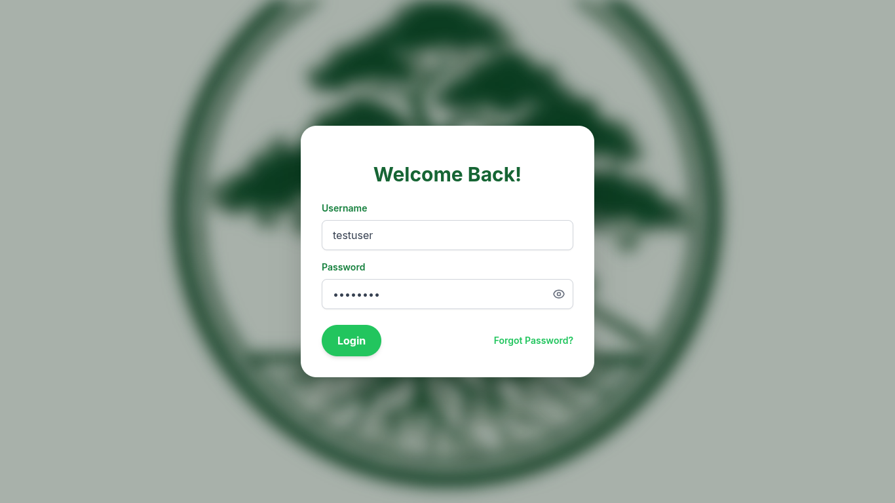
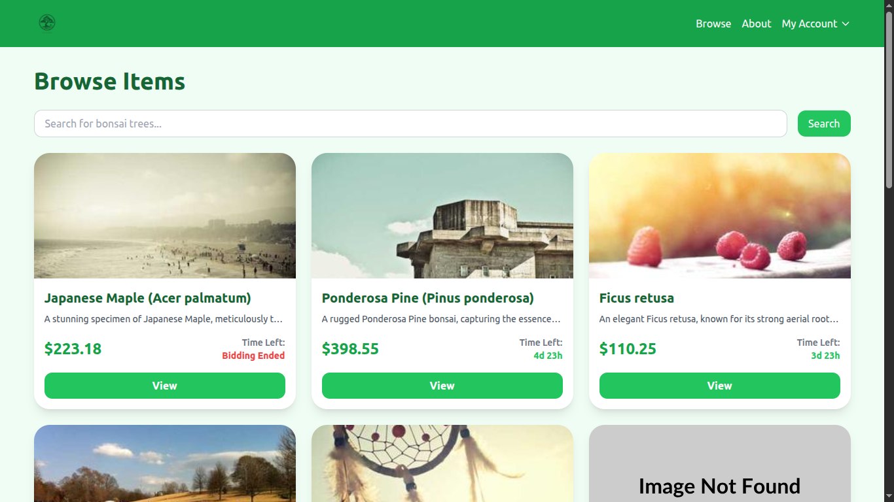
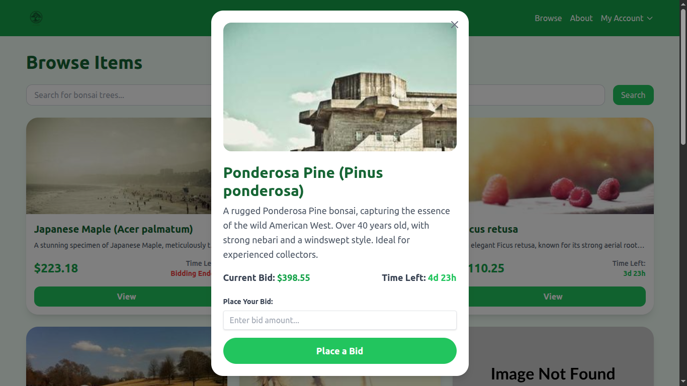
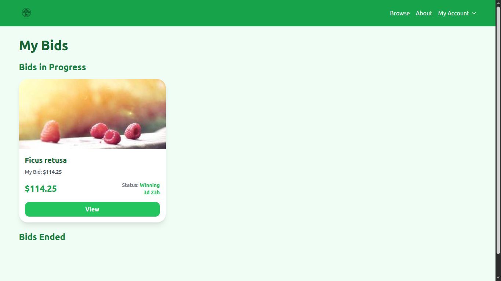

# Bonsai Bidding Site

A dynamic web application for a fictional online bonsai auction, demonstrating a modular and scalable frontend architecture.

<!--  -->

  
  
  
  

## 🚀 Live Demo

[Check out the live version here!](https://bidding-website-git-main-richard-ilis-projects.vercel.app/)

## ✨ Features

* **View Auction Items**: Browse a list of unique bonsai with their details and current bids.
* **Place a Bid**: Submit a custom bid amount that updates in real-time.
* **Track Your Bids**: Keep an eye on your bid status (Winning/Outbid) in a dedicated "My Bids" section.
* **Responsive Design**: The site is fully responsive and works on both desktop and mobile devices.

## 🛠️ Technologies Used

* **Frontend**: HTML, CSS (Tailwind CSS), Vanilla JavaScript (ES6 Modules)
* **Backend**: Node.js, Express.js
* **API**: A custom-built, simple JSON API for item data.

## 🧠 What I Learned

This project was a fantastic opportunity to practice several key concepts:

* **Modular JavaScript**: The biggest improvement was refactoring the monolithic `main.js` file into separate, reusable modules (`app.js`, `ui.js`, `api.js`). This significantly improved code organization and made the project much easier to maintain.
* **State Management**: I learned how to manage application state on the frontend (`allItems`, `myBids`) and ensure the UI stays synchronized with the data.
* **Event Handling**: Implementing event listeners dynamically for newly rendered elements was a core challenge. I solved this by using event delegation and ensuring listeners are set up after a render.

## 🏃 Getting Started

To run this project locally, follow these steps:

1.  Clone the repository:
    `git@github.com:RichardIli/Bonsai-Bidding-Website.git`
2.  Install dependencies (for the Node.js server):
    `cd project-folder`
    `npm install`
3.  Start the server:
    `npm start`
4.  Open your browser and navigate to `http://localhost:3000`.

---

By following these steps, you’ll transform your project from a simple code repository into a powerful showcase of your skills and dedication. What part of this process do you want to start with?